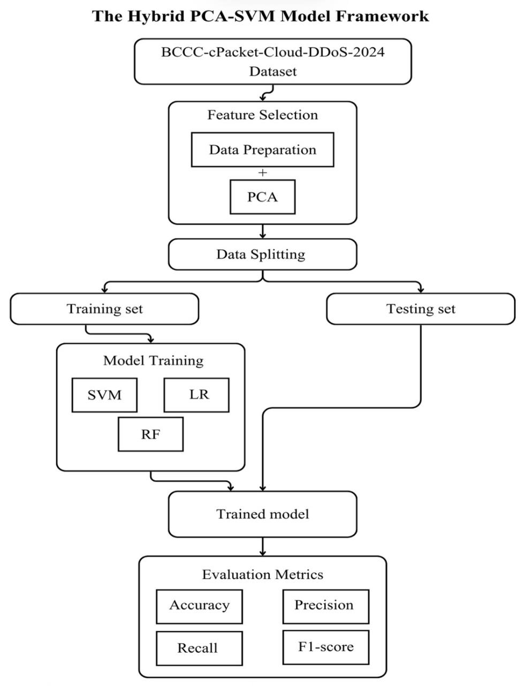
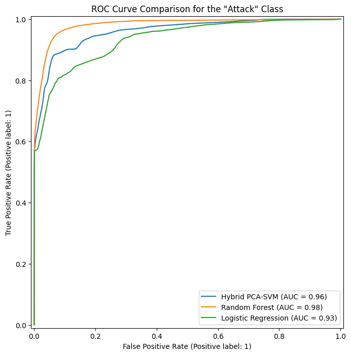
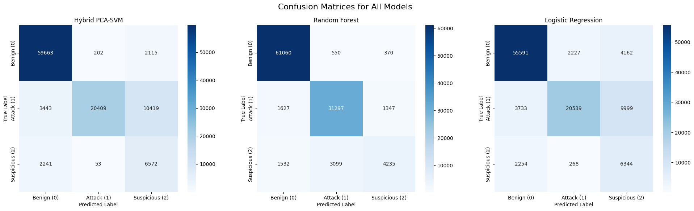
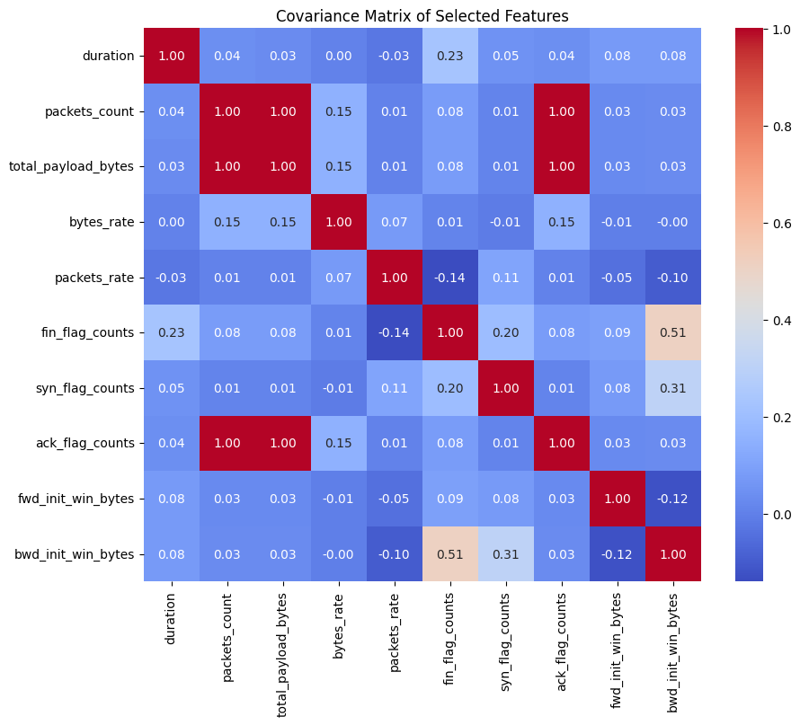
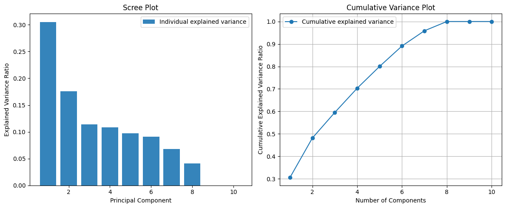

# Hybrid PCA-SVM Model for DoS Attack Detection

A machine learning project that combines **Linear Algebra** and **ML** 
to classify network traffic into Normal, Attack, and Suspicious categories.

Built with: Python • Scikit-learn • NumPy • Pandas • Google Colab

---

##  The Core Idea

Modern network traffic datasets are extremely high-dimensional (318 features).
This project applies **Principal Component Analysis (PCA)** — rooted in 
Linear Algebra — to reduce dimensionality while preserving 95% of the 
information, then trains an **SVM classifier** on the reduced feature set.

---

## Mathematical Foundation

This project is built on core Linear Algebra concepts:

| Concept | Role in Project |
|---------|----------------|
| **Standard Scaling (Z-score)** | Normalize features before PCA |
| **Covariance Matrix** | Capture relationships between 318 features |
| **Eigen-Decomposition** | Find principal directions of variance |
| **Orthogonality** | Ensure PCA components don't overlap |
| **Projection Matrix** | Transform data into reduced space |
| **Normal Equation** | Compute decision boundary coefficients |
| **SVD** | Alternative decomposition for PCA |

---

##  Dataset

- **BCCC-cPacket-Cloud-DDoS-2024** — York University & cPacket
- 700,774 network flow records
- 318 features (flow statistics + protocol attributes)
- 3 classes: Benign (0), Attack (1), Suspicious (2)

---

##  Methodology
318 Features → Standard Scaling → Covariance Matrix →

Eigen-Decomposition → PCA (56 components, 95% variance) →

SVM Classifier → Benign / Attack / Suspicious

**Data Split:** 70% Training | 15% Validation | 15% Testing

---

##  Results

| Model | Accuracy | Precision (Attack) | Recall (Attack) | F1-Score |
|-------|----------|--------------------|-----------------|----------|
| **Hybrid PCA-SVM** (my) | 82.43% | **98.77%** | 60.00% | 74.30% |
| Random Forest | 91.89% | 89.56% | 91.00% | 90.43% |
| Logistic Regression | 78.46% | 89.17% | 60.00% | 71.68% |

>  PCA-SVM achieved the **highest precision (98.77%)** — meaning when 
> it flags an attack, it's virtually certain to be a real threat.

---

##  Dimensionality Reduction

PCA reduced the feature space from **318 → 56 dimensions** while 
retaining **95% of the total variance**.

| Component | Variance Ratio |
|-----------|---------------|
| PC1 | 30.53% |
| PC2 | 17.60% |
| PC3 | 11.38% |
| PC4 | 10.81% |
| ... | ... |

---

## Visualizations

### PCA Framework

### ROC Curve Comparison

### Confusion Matrices

### Covariance Matrix Heatmap

### PCA Variance Plot

---

## How to Run

1. Upload the BCCC-cPacket-Cloud-DDoS-2024 dataset to Google Drive
2. Open the notebook in Google Colab
3. Run all cells in order

---

##  Author

Sharifa Alzubaidi 
